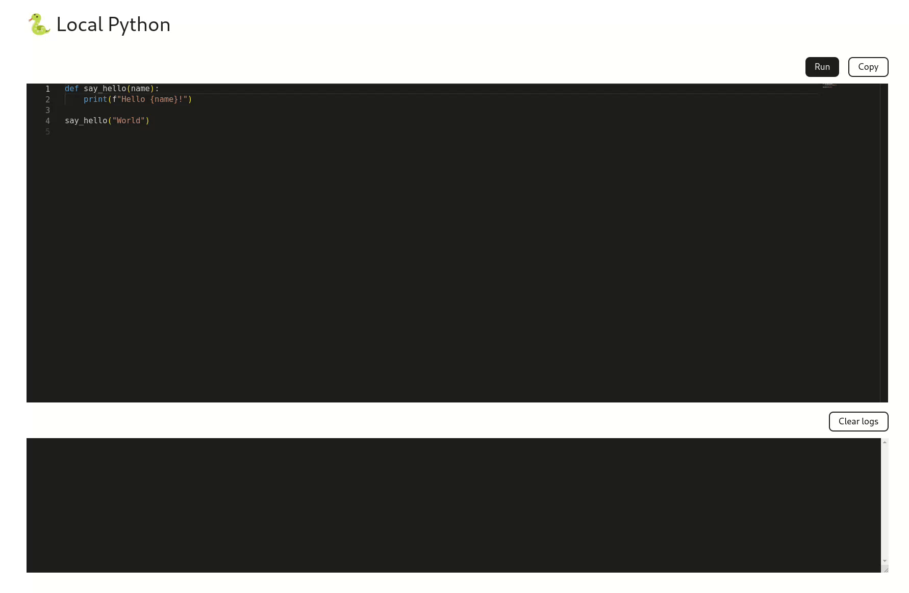

# 🐍 Local Python

Welcome to the Local Python project! This project allows you to write and execute Python code directly in your web browser, providing a convenient and lightweight environment for experimenting, testing, and learning Python programming.

## Features

- **Interactive Python Shell**: Write and execute Python code interactively, with immediate feedback.
- **Syntax Highlighting and Code Completion**: Enhance productivity with syntax highlighting and code completion features.
- **User-Friendly Interface**: A simple and intuitive interface designed for ease of use.

## Getting Started

### Prerequisites

- Web browser (e.g., Chrome, Firefox, Safari)

### Installation

No installation is required. Simply open the application in your web browser to start using it.

### Usage

1. Open the application in your web browser.
2. Start typing your Python code in the provided editor.
3. Press the "Run" button to execute the code.
4. View the output and any error messages in the console.
5. Press the "Clear logs" button to (you get the idea).
6. Press the "Copy" button to copy the code previously written.

## Demo

You can try out a live demo of the application [here](https://lahcenhaouch.github.io/local_python/).

## Contributing

Contributions are welcome! If you have any suggestions, bug reports, or feature requests, please open an issue or submit a pull request.
